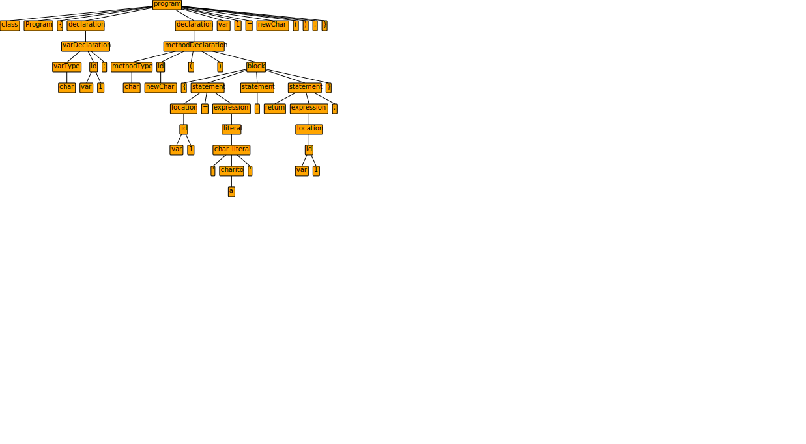

# py-antlr-input
Input an ANTLR grammar and test file for python to render a parser tree of the file. This program will make use of the **grun** command that comes with ANTLR.

## Requirements
* python 3.5 or higher
* tkinter (python library)
* java
* ANTLR (with antlr4 and grun commands configured)

## Usage
With your terminal, go to the repo directory and run:
```
python ./main.py
```
from there, the program should guide you. Take into account that you'll need:
* The name of the grammar
* An ANTLR4 grammar file (.g4)
* The name of the start rule
* A test file for your output language


You may also use the default Decaf grammar file specified in *Decaf/Decaf.g4* by adding **Decaf** as an argument
```
python ./main.py Decaf
```
This will make the program only ask for the .decaf file you want to see the parser tree of.

## Examples

### Cow.decaf
This file has a lot of defined rules covered. Here's the parse tree for the [code](./Decaf/cow.decaf):

<p align="center">

</p>

### test.decaf
Just a regular test file. Useful when testing the grammar for the first time. Here's the [code](./Decaf/test.decaf)

<p align="center">

</p>

### Error handling
If there's just a small amount of errors, then the program will still render the parse tree with a bit of red highlighted where the code wasn't correcty specified. Make sure to check the terminal output for more details.

<p align="center">

</p>


## Support
This tools has support for both Windows and Unix based operative systems.

## References
* ANTLR4 Website: https://www.antlr.org/
* Tkinter for python: https://docs.python.org/3/library/tkinter.html

## Author
* Oscar Juárez